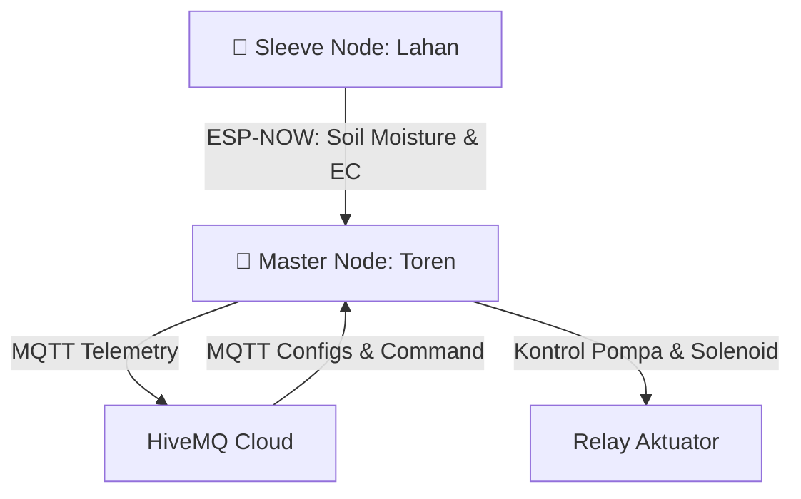

<div align="center">

# 🍈 Agro-Technology Melon
**Sistem Pertanian Pintar (Smart Farming) & Fertigasi Otomatis untuk Budidaya Melon**


</div>

---

> 💡 **Agro-Technology-Melon** adalah proyek *Internet of Things* (IoT) terintegrasi yang dirancang untuk mengotomatisasi proses fertigasi (pemupukan dan irigasi) secara presisi pada tanaman melon.
>
> Sistem ini terbagi menjadi dua bagian utama (Node) yang saling berkomunikasi menggunakan protokol **ESP-NOW** untuk menjamin latensi rendah dan reliabilitas tinggi tanpa memerlukan jaringan Wi-Fi eksternal, dilengkapi dengan integrasi **MQTT** untuk monitoring dan konfigurasi jarak jauh.

---

## 🏗️ Arsitektur Sistem



| Node | Direktori | Fungsi Utama |
|:---:|:---|:---|
| 👑 **Master** | `/Master/` | Pusat kontrol FSM, penjadwalan RTC, manajemen relay pompa, monitoring kesehatan tanah, dan pembacaan sensor kualitas air (pH, TDS, Suhu Air, Water Level, Flow Meter). |
| 📡 **Sleeve** | `/Sleeve/` | Node *slave* (Sensor Node) di lahan yang bertugas membaca kondisi tanah (Kelembapan, EC) dan mengirimkannya ke Master via ESP-NOW. |

---

## 📁 Struktur Direktori

```ext
Agro-Technology-Melon/  
├── Master/                 # 🧠 Otak Sistem (Pusat Kontrol)  
│   ├── platformio.ini      # Konfigurasi PlatformIO  
│   └── src/  
│       ├── Main.ino        # Entry point Master  
│       ├── actuators/      # Manajemen Relay & Pompa  
│       ├── communication/  # Protokol ESP-NOW (Penerima) & MQTT  
│       ├── config/         # Konfigurasi Pin & Sistem  
│       ├── fsm/            # Finite State Machine (Logika Fertigasi & Soil Monitor)  
│       ├── recipe/         # Resep Nutrisi & Irigasi  
│       ├── rtc/            # Real-Time Clock & Penjadwalan  
│       ├── sensors/        # Pembacaan Sensor Kualitas Air  
│       └── utils/          # Filter Data & Error Handling  
│  
└── Sleeve/                 # 🌱 Sensor Node (Lahan)  
    ├── platformio.ini      # Konfigurasi PlatformIO  
    └── src/  
        ├── main.ino        # Entry point Sleeve  
        ├── communication/  # Protokol ESP-NOW (Pengirim)  
        ├── config/         # Konfigurasi Pin  
        ├── sensor/         # Pembacaan Sensor Tanah  
        └── utils/          # Filter Data Sensor  
```

---

## ✨ Fitur Utama

- 🔄 **Otomatisasi FSM**: Alur pencampuran air dan nutrisi (A/B Mix) diproses terstruktur dengan *Finite State Machine*.
- 🧪 **Manajemen Resep Nutrisi**: Penyesuaian resep irigasi sesuai dengan **fase pertumbuhan** melon.
- 🎯 **Sensor Presisi**: Penggunaan *Median Filter* & *Moving Average* untuk menstabilkan pembacaan pH, TDS, dan Flow Meter.
- ⚡ **Komunikasi ESP-NOW**: Pengiriman data tanah dari lahan (Sleeve) ke tandon (Master) secara *realtime* & nirkabel.
- 🕒 **RTC Scheduling**: Irigasi tereksekusi akurat tersinkronisasi waktu nyata (DS3231/PCF8563).
- 🩺 **Soil Health Monitor & Auto-Switch**: 
  - Mengevaluasi kesehatan sensor tanah melalui 4 aturan utama: *Heartbeat Timeout*, *Out-of-range ADC*, *Flatline/Stuck Detection*, dan *No Response after Watering*.
  - Otomatis melakukan *failover* (auto-switch) ke **Timer Mode** jika skor kesehatan sensor $\le 50\%$.
- 📅 **Flexible Mixing Interval & Recipe Grouping**:
  - Mendukung interval pengisian/pencampuran $N$-harian.
  - Memilih target PPM paling konservatif (aman) dalam satu grup siklus pencampuran.
  - Validasi *pH overlap* otomatis; menghentikan pencampuran jika rentang pH target tidak kompatibel (`RECIPE_PH_CONFLICT`).
- 🛡️ **Dynamic Minimum-Liter Safety Check**:
  - Mengkalkulasi kebutuhan air minimum tangki secara dinamis berdasarkan sisa hari siklus fertigasi.
  - Memblokir irigasi jika volume tangki tidak memadai, serta mengirimkan notifikasi defisit air via MQTT (`greenhouse/alert/tank_low`).
- 🌀 **Stirring Schedule**:
  - Pengadukan otomatis 2x sehari (pagi setelah pengecekan tangki lolos, dan sore sesuai jam konfigurasi MQTT).
  - Durasi pengadukan yang presisi menggunakan timer independen.

---

## 🛠️ Persyaratan Perangkat Keras

### 💻 Mikrokontroler
- 2x **ESP32-S3 DevKitM-1** (Untuk Node Master & Sleeve)

### 🌊 Sensor Air (Master Node)
- **pH Sensor** (DFRobot)
- **TDS Sensor** 
- **DS18B20** (Suhu Air)
- **Ultrasonic / AJSR04M** (Ketinggian Air / Water Level)
- 3x **Water Flow Sensor** (Flow A, Flow B, Flow Irigasi)

### 🌱 Sensor Tanah (Sleeve Node)
- **Soil Moisture / EC Sensor** (Capacitive Probes)

### ⚙️ Aktuator & Modul Lain
- **Modul RTC DS3231 / PCF8563**
- **Relay Module Multi-channel** (Pompa A, Pompa B, Pompa Utama/Mixer, Solenoid A/B/Irigasi, Stirrer)

---

## 🚀 Panduan Kompilasi & Upload

Proyek ini wajib dibangun menggunakan **PlatformIO** karena mengadopsi arsitektur C++ modular tingkat lanjut.

### 1️⃣ Persiapan Environment
1. Unduh dan instal **[Visual Studio Code](https://code.visualstudio.com/)**.
2. Masuk ke panel **Extensions** (`Ctrl+Shift+X`).
3. Cari dan instal **PlatformIO IDE**.
4. *Restart* VS Code setelah instalasi core selesai.

### 2️⃣ Membuka Proyek
⚠️ **PENTING**: Karena terdapat 2 sistem independen, buka foldernya secara spesifik:
- **File > Open Folder...** -> Pilih `Agro-Technology-Melon/Master`
- Atau **File > Open Folder...** -> Pilih `Agro-Technology-Melon/Sleeve`

*PlatformIO akan otomatis mengunduh library yang dibutuhkan (RTClib, DallasTemperature, OneWire, ArduinoJson, dll).*

### 3️⃣ Compile (Build) Kode
Pastikan kode bebas *error* sebelum diunggah:
- **GUI**: Klik ikon `✓` (Build) di *status bar* bawah.
- **CLI**: Buka terminal terintegrasi (`Ctrl + ~`) lalu jalankan:
  ```bash
  pio run
  ```

### 4️⃣ Upload ke ESP32-S3
1. Hubungkan board ESP32-S3 via kabel USB data.
2. **GUI**: Klik ikon `→` (Upload) di *status bar* bawah.
3. **CLI**: 
  ```bash
  pio run --target upload
  ```

### 5️⃣ Memantau Serial Monitor
Untuk melihat *log* kualitas air dan transisi state FSM:
- **GUI**: Klik ikon `🔌` (Serial Monitor).
- **CLI**: 
  ```bash
  pio device monitor
  ```
*(Baudrate default: `115200`)*

---

<div align="center">
  <i>Dibuat dengan ❤️ untuk Masa Depan Pertanian Pintar</i>
</div>
